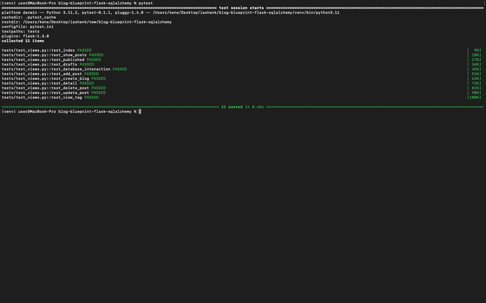

# Project README



## Instructions on How to Run the Test

To run the test for this project, follow these steps:

1. **Open Terminal**: Open your terminal and navigate to the directory where you have saved the code.

2. **Create Virtual Environment**: Use the following commands to create and activate a virtual environment:
   ```bash
   python3 -m venv venv  # Create virtual environment
   source venv/bin/activate  # Activate virtual environment
   ```
   Make sure you have Python installed on your system.

3. **Run Tests**: Run the following command in your terminal to execute the tests:
   ```bash
   pytest
   ```

## Challenges Faced

During the development process, I encountered several challenges:

1. **SAWarning**: A warning regarding the `SAWarning: TypeDecorator AwareDateTime()` was observed, indicating that it would not produce a cache key. To resolve this, I added `cache_ok = True` to the `AwareDateTime` class.

2. **/add Route Issue**: The `/add` route was returning a response with a 200 status code but was not adding the data to the database.

3. **/update/<pid> Route Issue**: The `/update/<pid>` route was not updating the data in the database. Although it returned a 200 status code, the post was not being updated in the database.

4. **Dependency Versioning**: Initially, using the versions of packages specified in the `requirements.txt` file resulted in an error `ImportError: cannot import name 'Markup' from 'jinja2'`. To address this, I had to upgrade some packages.

5. **Legacy API Usage**: The upgrade led to a `LegacyAPIWarning` due to the use of `Post.query.get(pid)`, which is deprecated in Flask-SQLAlchemy.

Please feel free to reach out if you have any questions or need further assistance with the project.
